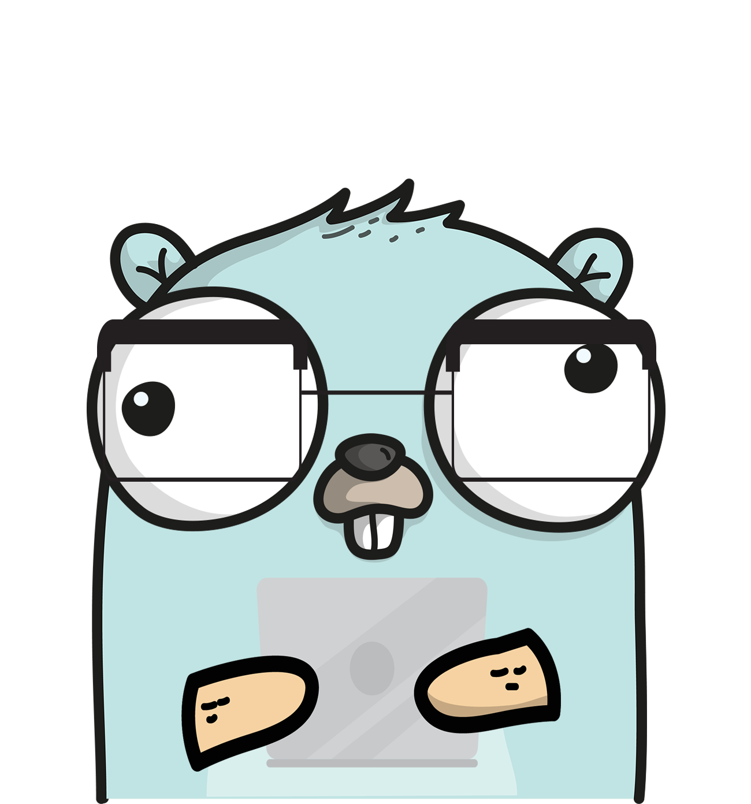

<p align="center">
    
</p>


[](https://pkg.go.dev/github.com/mkdemir/vigilsys)
[](https://goreportcard.com/report/github.com/mkdemir/vigilsys)

# vigilsys

**vigilsys**  is a system monitoring tool developed using the Go programming language. **vigilsys** is designed to monitor the overall performance of a computer or server, track resource usage, and visualize the system's status.

---

## Installation

Go to your project root, where `go.mod` file exists, than grab the library via:

```bash
go get github.com/mkdemir/vigilsys@latest
```

---

## Usage

```go
package main

import (
	"fmt"
)

func main(){
	fmt.Println("mkdemir") // mkdemir
}
```

---

## Makefile

```bash
make help
```

Commands usage:

```bash
make <command>

commands:

test       run tests
testfuzz   run tests with fuzz (30 seconds)
bench      run benchmark tests
doc        run godoc server at 3000 unless PORT env-var is set
```

- `make test`: Runs tests
- `make testfuzz`: Runs Fuzzy tests for 30seconds (`go 1.18`)
- `make bench`: Runs benchmark tests
- `make doc`: Runs godoc server on port 3000. Use `PORT` environment variable
  for different port -> `PORT=4000 make doc`

---

## Contributor(s)

* [mkdemir](https://github.com/mkdemir) - Creator, maintainer

---

## Contribute

All PR’s are welcome!

1. `fork` (https://github.com/mkdemir/vigilsys/fork)
1. Create your `branch` (`git checkout -b my-feature`)
1. `commit` yours (`git commit -am 'add some functionality'`)
1. `push` your `branch` (`git push origin my-feature`)
1. Than create a new **Pull Request**!

---

## License

This project is licensed under MIT

---

This project is intended to be a safe, welcoming space for collaboration, and
contributors are expected to adhere to the [code of conduct][coc].

[coc]: https://github.com/mkdemir/vigilsys/blob/main/CODE_OF_CONDUCT.md